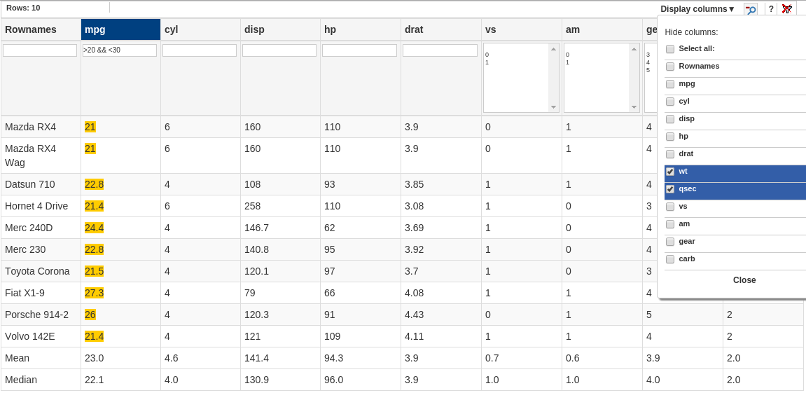
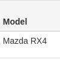
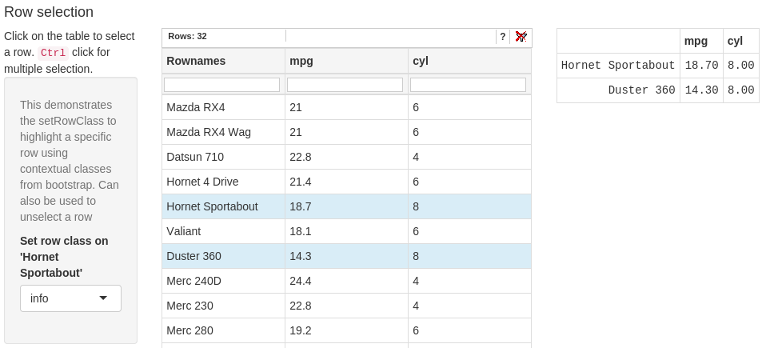
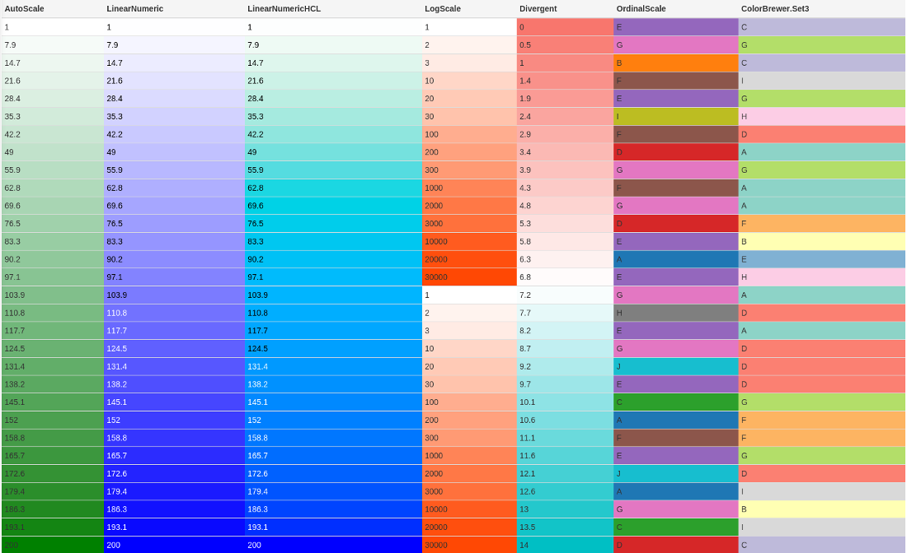
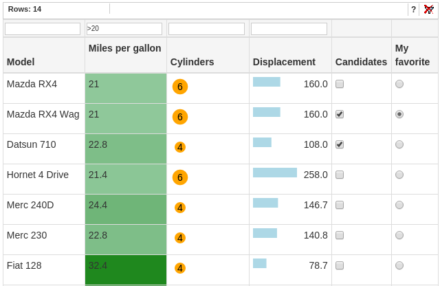
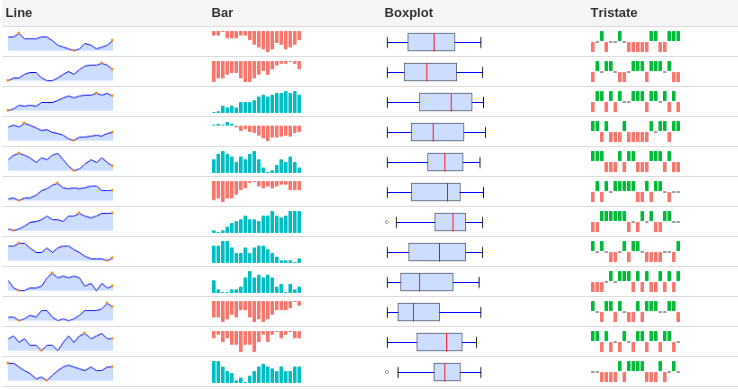

# News
Update of included libraries:

* TableFilter v0.4.15
This is a major update of [TableFilter](http://koalyptus.github.io/TableFilter/), resulting in an API change in D3TableFilter. <span style="color:#DF0101">TableFilter extensions now have to be specified as lists</span> - see the [feature](https://github.com/ThomasSiegmund/D3TableFilter/blob/master/inst/examples/feature/server.R) app for a complete example.
<span style="color:#DF0101">[Sorting](http://koalyptus.github.io/TableFilter/sort.html) and [column operations](http://koalyptus.github.io/TableFilter/column-calculations.html) now also are TableFilter extensions.</span> Interactive column resizing is [currently not supported](https://github.com/koalyptus/TableFilter/issues/311) in TableFilter.

* jquery update to version 1.12.3 to match the version included in Shiny
* Bootstrap update to match the version included in Shiny 

# Overview

[TableFilter](http://koalyptus.github.io/TableFilter/) (*TableFilter*) by Max Guglielmi is a JavaScript library to enhance HTML tables. It it provides a number of useful features:

* Advanced filtering
    + numeric (```> 0```)
    + logical (```black || white```)
    + regular expressions
* Sorting
* Pagination
* Column visibility

The R package *D3TableFilter* packages the *TableFilter* JavaScript library as an easy to use widget for [Shiny](http://www.rstudio.com/products/shiny/). It can be used in [RStudio](http://www.rstudio.com/products/RStudio/) and in Shiny applications. The package is based on the [htmlwidgets](https://github.com/ramnathv/htmlwidgets) library which allows to integrate JavaScript libraries into R and Shiny.

In addition to the impressive feature set of the *TableFilter* library the *D3TableFilter* R widget provides some additional functions:

* Filters can be set within the widget but also via R functions. Filter settings and filter results can be retrieved from the widget for use on the server.

* Row selection. Single cell selection (radiobutton like) or multiple row selection using the ctrl key is possible. Selection can also be set or reset by the server.

* Editing. The tableFilter widget can provide simple table editing features. Via a custom shiny input element each editing event in the table gets sent to the shiny app. After server side validation feedback can be given to the user within the widget. Logical columns can be presented as radio boxes or as checkbox input elements. It should be noted though that Max provides an extension [ezEditTable](http://codecanyon.net/item/-ezedittable-enhance-html-tables/2425123) which gives more extensive editing capabilities. Since ezEditTable is not free software it is out of the scope of *D3TableFilter*.

* Coloring. Similar to conditional formatting in spreadsheet applications text and cell background can be colorized based on cell values. The [D3.js](http://d3js.org/) visualization library is used to generate smooth colour scales. This allows for a broad range of available scales.
    + linear
    + logarithmic
    + threshold
    + categorical
    + ColorBrewer
    + ...

* Cell styling and in-cell graphics. Can format text or turn cell values into SVG graphics using D3.js functions.

* Sparklines. Small graphs in table cells can be generated using the integrated [jQuery Sparkline](http://omnipotent.net/jquery.sparkline) library. 

* Cross-widget interactions (linked selection and filtering) via [crosstalk](http://rstudio.github.io/crosstalk/index.html).

Thanks to the [shinyapps.io](https://www.shinyapps.io) service you can test various features of the D3TableFilter widget in a couple of demo apps online:

* [Basic features](https://thomassiegmund.shinyapps.io/basic/)
* [Advance TableFilter features](https://thomassiegmund.shinyapps.io/features/)
* [Colorful tables](https://thomassiegmund.shinyapps.io/colour/)
* [Interactive features](https://thomassiegmund.shinyapps.io/interaction/)
* [Mixed sorting](https://thomassiegmund.shinyapps.io/mixedsort/)


# Installation
D3TableFilter is not yet on CRAN, but you can easily install it from Github using
the devtools package:

```r
install.packages("devtools")
devtools::install_github("ThomasSiegmund/D3TableFilter")
```

# First steps
Generating a table with filtering and sorting options in a Shiny app using the tableFilter library is very simple. First your have to declare a ```d3tfOutput``` in your user interface definition. In server.R or the ```shinyServer``` you define the corresponding output function. The ```d3tf``` function needs only one argument: ``df``, the data.frame or matrix which will be transformed into a html table.

Optionally the ```tableProps``` argument can be used to define the look and feel of the table. In the example below, a very simple table is generated.

```r
# --------------------------------------------------------
# Minimal shiny app demonstrating the D3TableFilter widget

library(shiny)
library(htmlwidgets)
library(D3TableFilter)
data(mtcars)

# ui.R
# --------------------------------------------------------
ui <- shinyUI(fluidPage(
  title = 'Basic usage of D3TableFilter in Shiny',
  fluidRow(
    column(width = 12, d3tfOutput('mtcars'))
  )
))

# server.R
# --------------------------------------------------------
server <- shinyServer(function(input, output, session) {
  output$mtcars <- renderD3tf({
    
    # Define table properties. See http://tablefilter.free.fr/doc.php
    # for a complete reference
    tableProps <- list(
      btn_reset = TRUE,
      # alphabetic sorting for the row names column, numeric for all other columns
      col_types = c("string", rep("number", ncol(mtcars)))
    );
    
    d3tf(mtcars,
         tableProps = tableProps,
         extensions = list(
           list(name = "sort")
         ),
         showRowNames = TRUE,
         tableStyle = "table table-bordered");
  })
})


runApp(list(ui=ui,server=server))

```

An optional parameter for tableFilter, ```showRowNames``` enables the display of the row names as first column.


Running this app generates a html table which can be filtered for strings, numbers, numeric expressions and regular expressions. There is a reset button for the filters in the upper right corner, and small help popup behind the question mark also in the upper right. The table can be sorted by mouseclick on the column headers.

## Getting and setting filters
As an app developer you may want to know which filters a user has set, e.g. to provide statistics on the filtered rows or to allow for an export of the filtered data. If activated using ```filterInput = TRUE``` as argument to ```d3tf``` there is for each table an input called outputid + "_filter" which provides a list of

* the filters entered by the user
* an index of the table rows visible after filtering

This variation of the above app prints the current filter settings and the valid rows after filtering:

```r
# --------------------------------------------------------
# Minimal shiny app demonstrating the D3TableFilter widget
# server.R
# --------------------------------------------------------
library(shiny)
library(htmlwidgets)
library(D3TableFilter)

data(mtcars);

shinyServer(function(input, output, session) {
  output$mtcars <- renderD3tf({
    
    # Define table properties. See http://tablefilter.free.fr/doc.php
    # for a complete reference
    tableProps <- list(
      btn_reset = TRUE,
      # alphabetic sorting for the row names column, numeric for all other columns
      col_types = c("string", rep("number", ncol(mtcars)))
    );
    
    observe({
      if(is.null(input$mtcars_filter)) return(NULL);
      
      filterSettings <-input$mtcars_filter$filterSettings;
      tmp <- lapply(filterSettings,
                  function(x) data.frame(Column = x$column,
                                         Filter = x$value, stringsAsFactors = FALSE));
      filters <- do.call("rbind", tmp);
      
      print("Active filters:")
      print(filters)
      
      rowIndex <- unlist(input$mtcars_filter$validRows);
      print("Valid rows:")
      print(mtcars[rowIndex, ]);
      
    })
    
    d3tf(mtcars,
         tableProps = tableProps,
         extensions = list(
           list(name = "sort")
         ),
         showRowNames = TRUE,
         filterInput = TRUE,
         tableStyle = "table table-bordered");
  })
})

```

TableFilter has a cookie based mechanism to restore filter settings after page reload (```remember_grid_values = TRUE``` in ```tableProps```). Alternatively you could restore filter settings by using the ```initialFilters argument```.

```r
d3tf(mtcars, showRowNames = TRUE, initialFilters = list(col_0 = "Merc", col_1 = ">20"));
```

Filters can be set programmatically at run time using the ```setFilter()``` function. There is also a ```clearFilters``` function to reset all filter inputs in a table. The *examples/interaction* Shiny app demonstrates these functions.

# Customizing the table
The Table Filter JavaScript library provides a huge number of configuration options which define the appearance and behaviour of the table. It can for example do client side paging. It can provide a control to hide selected columns. It can provide checkbox and lists controls for filtering and many more. A complete discussion of the features of Table Filter is beyond the scope of this document. Please see [TableFilter](http://koalyptus.github.io/TableFilter/) for examples and documentation. In the *examples/feature* directory of this package is a Shiny app demonstrating quite a few TableFilter features in a single table. It shows sorting, filtering, pagination, rows counter, column visibility, and a table footer with column statistics.



## TableFilter extensions
Some of the TableFilter functions are beeing provided as separate modules, in particular
* Sorting
* ColsVisibility: Visibility of columns can be adjusted by configuration or interactively
* FiltersRowVisibility: Interactively show or hide the filter row.

To activate these extensions simply define them as a list in the extensions parameter, e.g.
```r
    extensions <-  list(
        list(name = "sort"),
        list( name = "colsVisibility",
              at_start =  c(8, 9, 10, 11),
              text = 'Hide columns: ',
              enable_tick_all =  TRUE
             ),
        list( name = "filtersVisibility",
              visible_at_start =  TRUE)
      );
```
This takes care of enabling and configuration of the extensions.

## Sorting
On click on column headers *TableFilter* sorts the table. It can sorted by ```string```, various number formats ```number, eu, us```, different date formats ```dmydate, mdydate, ymddate, ddmmmyyyy'```, and by ```'ipaddress'```. Sorting of specific columns can be defined in the ```tableProps``` argument:

```r
  tableProps <- list(
      # sort first column by character, second by US number format,
      # third column by date format 08/05/2010 
      col_types = c("string", "number", "mdydate") 
  )
```

Additionally the sort extension has to be loaded:

```r
  extensions <- list(
           list(name = "sort")
         )
  
    d3tf(x,
         tableProps = tableProps,
         extensions = extensions
         )

```

The [TableFilter documentation](http://tablefilter.free.fr/doc.php]) has some more details about sorting.  *D3TableFilter* extends the list of sort types by the ```Mixed```. This function is based on the [mixedorder](http://www.inside-r.org/packages/cran/gtools/docs/mixedorder) function from the gtools package. It allows to sort character strings containing numbers in a logical order. See the *examples/mixedsort* Shiny app for an example.


## Bootstrap styling
TableFilter comes with its own CSS based default styling which is compact and efficient, but can look a little bit out of place within Bootstrap styled Shiny apps. Per default D3TableFilter applies the basic Bootstrap table class (```table```). This behaviour can be modified using the ```tableStyle``` argument. Bootstrap provides the classes ```table```, ```table-striped```, ```table-bordered```, and ```table-condensed```. These classes can be combined, e.g. ```tableStyle = "table table-striped table-bordered"```. ```tableStyle = NULL``` reverts to the original TableFilter CSS. 

# Table Footer
TableFilter provides functions for statistical summaries in a table footer (see ```col_operation``` in the [TableFilter documentation](http://tablefilter.free.fr/doc.php]). D3TableFilter supports this by providing the ```footData``` argument to ```d3tf```. It allows to attach one or more rows to a table to be used as footer. The TableFilter ```col_operation``` functions need cells with unique id to display their results. D3TableFilter supports this by supplying a unique id for each cell in a footer. The cell at the first footer row, second column in a table "mtcars" would get the id ```frow_0_fcol_1_tbl_mtcars```. See the *examples/feature* Shiny app for an example.

Alternatively to these values calculated by JavaScript the data for a table footer can be supplied directly from R via the footData argument. These can be updated dynamically using the ```setFootCellValue``` function. An example for this can be found in the *examples/interaction* Shiny app. Here the footer row shows column mean or column median values depending on a select input:

```r
  # update summary row. calculate mean/median of displayed row for cols 1:3
  observe({
    for (col in c(1, 2, 3)) {
      if(input$summaryRow == "mean") {
        setFootCellValue(session, tbl = "mtcars", row = 1, col = 0, value = "Mean");
        value = round(mean(revals$mtcars[revals$rowIndex, col]), 1);
      } else {
        setFootCellValue(session, tbl = "mtcars", row = 1, col = 0, value = "Median");
        value = round(median(revals$mtcars[revals$rowIndex, col]), 1);
      }
      setFootCellValue(session, tbl = "mtcars", row = 1, col = col, value = value);
    }
  })
```

# Editing

Using the ```edit``` argument to d3tf the whole table (```edit = TRUE```) or selected columns (```edit = c("col_1", "col_3")```) can set to be editable. Table columns with logical values can be transformed into radio buttons or checkboxes for easy editing. It is also possible to enable or disable editing of columns dynamically:

```r
# enable editing of the first two columns of the "mtcars" table
enableEdit(session, "mtcars", c("col_1", "col_2"))

# disable editing of the first two columns of the "mtcars" table
disableEdit(session, "mtcars", c("col_1", "col_2"))
```

An editable table provides an input element named like the corresponding output element + "_edit". For performance reasons not the complete edited table is sent back from the browser to the server, but single edit events.
The ```_edit``` input element receives for each edit element in the corresponding table a list of row (```row```), column (```col```) and new value (```val```).

Within a Shiny app here an ```observe``` function should take care of validation and processing of these data. D3TableFilter provides two functions to send validation feedback to the user (```confirmEdit```, ```rejectEdit```). They allow to give visual feedback by means of a brief text colour transition. They also allow to revert the edit in case of a validation failure or to rewrite the value in case of a confirm.



Rewriting a validated edit may seem unneccessary at first, but it could help in case of difficult network conditions. Depending on the environment there is no guarantee that edit events in the browser get processed in the correct order on the server. If a user starts to edit a cell, waits briefly, and then continues to edit the same cell two edits could be sent back to the server. There is no guarantee that the second edit arrives after the first one on the server. Thus in *D3TableFilter* each edited cell gets tagged with a unique attribute and which is checked when the server sends a reject or confirm message. Only a confirm or reject message corresponding to the latest edit of a cell will find a matching id in the table.

```r
  # For a output object "mtcars" D3TableFilter generates an input "mtcars_edit".
  #
  # This observer does a simple input validation and sends a confirm or reject message
  # after each edit.
  observe({
    if(is.null(input$mtcars_edit)) return(NULL);
     edit <- input$mtcars_edit;
    
    isolate({
      # need isolate, otherwise this observer would run twice
      # for each edit
      id <- edit$id;
      row <- as.integer(edit$row);
      col <- as.integer(edit$col);
      val <- edit$val;
      
      # validate input 
      if(col == 0) {
        # rownames
        oldval <- rownames(revals$mtcars)[row];
        # rownames can not start with a digit
        if(grepl('^\\d', val)) {
          rejectEdit(session, tbl = "mtcars", row = row, col = col,  id = id, value = oldval);
          return(NULL);
        }
      } else if (col %in% c(1, 2, 3)){
        # numeric columns
        if(is.na(suppressWarnings(as.numeric(val)))) {
          oldval <- revals$mtcars[row, col];
          # reset to the old value
          # input will turn red briefly, than fade to previous color while
          # text returns to previous value
          rejectEdit(session, tbl = "mtcars", row = row, col = col, id = id, value = oldval);
          return(NULL);
        } 
      }
      
      # accept edits
      if(col == 0) {
        rownames(revals$mtcars)[row] <- val;
      } else if (col %in% c(1, 2, 3)) {
        revals$mtcars[row, col] <- as.numeric(val);
        val = round(as.numeric(val), 1)
      }
      # confirm edits
      confirmEdit(session, tbl = "mtcars", row = row, col = col, id = id, value = val);
     })
   })
```

Cell values can also be updated dynamically by the server without resending the whole table using the ```setCellValue()``` function. If a table uses coloring or inline graphics, these elements can react on edit events with smooth visual transitions. See *examples/interaction* for a Shiny app demonstrating this features.

# Row selection

A D3TableFilter table can act as a simple input element for row selection. The ```selectableRows``` argument to the ```d3tf``` function makes ```single``` or ```multiple``` rows selectable. Using the ```selectableRowsClass``` argument you can use a choice of Bootstrap classes to modify the look of selected rows. A new input element (named like the corresponding output element + "_edit") will provide a vector of indices of selected rows. To pre-select rows when generating a new table, the "rowStyles" argument to ```d3tf()``` can be used. At run time rows can be (de-)selected using the ```setRowClass()``` function.



Technically ```selectableRows``` can be combined with other D3TableFilter features. From a user point of view it may be confusing though to have selected rows which are hidden by the filtering function. Thus it may be a good idea to switch off filtering in this case using  ```enableTf = FALSE```. An example for a table with selectable rows is on the second tab of the *examples/interaction* Shiny app:

# Coloring

Color can greatly enhance the perception especially of numerical values in tables. One of the driving forces in the development of D3TableFilter was the need for smooth, heatmap-like colors in tables. The D3.js library provides powerful mechanisms to map data to colors. I has support for simple linear color scales, but also logarithmic scales and ordinal scales (including the famous [ColorBrewer](http://colorbrewer2.org/) scales). D3TableFilter allows to make use of this for cell backgrounds as well as for the text color. *D3TableFilter* tries to provide the full D3.js tool set for colour scales, at the cost of exposing R programmers to the D3 javascript code. The following code sniplet for example could be used to colour cell the second column (```col_1```) in a table. Given a range of cell values between 0 and 200 (```.domain([0, 200])```) the cell background would be colored in white to blue (```.range(["white", "blue"])```) according to the cells numeric value.


```r
    bgColScales <- list(
       col_1 = JS('function colorScale(tbl, i){
        var color = d3.scale.linear()
                      .domain([0, 200])
                      .range(["white", "blue"]);
        return color(i);
      }')
      )
```

In this example the background color may get to dark to read the cell text. One solution obviously is to use a lighter background color. Another option is to modify the text color accordingly. The next code sniplet achives this by using a threshold function (```d3.scale.threshold()```) to switch the text color from black to white on a dark background.

```r
   fgColScales <- list(
      col_1 = JS('function colorScale(tbl, i){
        var color = d3.scale.threshold()
        .domain([130, 130, 200.1])
        .range(["black", "black", "white"]);
        return color(i);
      }')
      )
```

The result in shown in the second column in the table below.



Color perception is a complex issue. If you wish for a perceptionally correct mapping of numerical data to colour a linear scale as shown above is not the best solution. D3.js provides Lab and HCL color scales for this purpose. They make sure the perceived difference between two colors is propotional to the distance of the mapped values. The next code sniplet maps the same data as above to a white-blue palette in HCL space. The results is shown in the third column in the figure above.

```r
    bgColScales <- list(
       col_2 = JS('function colorScale(tbl, i){
        var color = d3.scale.linear()
        .domain([0, 200])
        .range(["white", "blue"])
        .interpolate(d3.interpolateHcl);
        return color(i);
      }')
      )
```

As a shortcut you can define linear hcl scales as automatic. The data range (```domain``` in D3 parlance) is determined automatically in this case.

```r
    bgColScales <- list(
     col_0 = "auto:white:green"
    )
```
Examples for different color scales can found in the *examples/colour* Shiny app.

# D3 cell styling

While the *TableFilter* library provides many features to modify the appearance of various table elements using CSS, it does not support directly the styling and formatting of text in table cells. You can not, for example, generate right aligned numeric columns using *TableFilter* alone. *D3TableFilter* allows this, similar to the color mapping, by use of D3. The ```cellFunctions``` and ```footCellFunctions``` argument to ```d3tf()``` apply D3 JavaScript code to columns in the table body or footer. The code below will make the first column (```col_0```) in a table footer right aligned ```classed("text-right", true)```, bold ```.style("font-weight", "bold")```and formatted with one decimal point ```d3.format(".1f")```. D3 has formatters for [numbers](https://github.com/mbostock/d3/wiki/Formatting) and [dates](https://github.com/mbostock/d3/wiki/Time-Formatting).

```r
    # apply D3.js functions to footer columns,
    # e.g. to format them or to turn cell values into scaled SVG graphics
    footCellFunctions <- list(
      col_0 = JS('function makeGraph(selection){
                // text formatting function
                var textformat = d3.format(".1f");
                // make cell text right aligned
                selection.classed("text-right", true)
                         .style("font-weight", "bold")
                         .text(function(d) { return textformat(d.value); });
            }')
    );

```

While the example is an serious application of D3 to generate good looking an correctly formatted tables, the following section is on the border of eye candy (or maybe a little bit beyond).

The ```cellFunctions``` argument can be used not only to format numbers, but to turn them into SVG graphics within a cell. The following code replaces numbers in the third column (```col_2```) into SVG filled circles. The area of the circles is scaled proportional to the numeric values. Finally the numbers are shown centered inside the circles.

```r
    cellFunctions <- list(
      col_2 = JS('function makeGraph(selection){
      
        // find out wich table and column
        var regex = /(col_\\d+)/;
        var col = regex.exec(this[0][0].className)[0];
        var regex = /tbl_(\\S+)/;
        var tbl = regex.exec(this[0][0].className)[1];
  
        // create a scaling function
        var domain = colExtent(tbl, col);
        var rScale = d3.scale.sqrt()
                       .domain(domain)
                       .range([8, 14]);

        // column has been initialized before, update function
        if(tbl + "_" + col + "_init" in window) {
            var sel = selection.selectAll("svg")
                     .selectAll("circle")
                     .transition().duration(500)
                     .attr("r", function(d) { return rScale(d.value)});
                     return(null);
        }

        // remove text. will be added later within the svg
        selection.text(null)

        // create svg element
        var svg = selection.append("svg")
              .attr("width", 28)
              .attr("height", 28);
              
        // create a circle with a radius ("r") scaled to the 
        // value of the cell ("d.value")
        var circle = svg.append("g")
              .append("circle").attr("class", "circle")
              .attr("cx", 14)
              .attr("cy", 14)
              .style("fill", "orange")
              .attr("stroke","none")
              .attr("r", domain[0])
              .transition().duration(400)
              .attr("r", function(d) { return rScale(d.value); }); 

        // place the text within the circle
        var text = svg.append("g")
              .append("text").attr("class", "text")
              .style("fill", "black")
              .attr("x", 14)
              .attr("y", 14)
              .attr("dy", ".35em")
              .attr("text-anchor", "middle")
              .text(function (d) { return d.value; });
        window[tbl + "_" + col + "_init"] = true;

      }')
    )
```

Surprisingly sorting and filtering based on the numbers still works as before. The *examples/interaction* Shiny app demonstrates this.



The *examples/interaction* Shiny app also shows a second variation of in-cell graphics, a horizontal bar chart. Here the text is not replaced, but overlayed to the graphic and can be edited. Enjoy smooth D3 transitions of the bar charts while editing the numbers!

```r
    # apply D3.js functions to a column,
    # e.g. to turn cell values into scaled SVG graphics
    cellFunctions <- list(
      col_3 = JS('function makeGraph(selection){

        // find out wich table and column
        var regex = /(col_\\d+)/;
        var col = regex.exec(this[0][0].className)[0];
        var regex = /tbl_(\\S+)/;
        var tbl = regex.exec(this[0][0].className)[1];
        var innerWidth = 117;
        var innerHeight = 14;
        
        // create a scaling function
        var max = colMax(tbl, col);
        var min = colMin(tbl, col);
        var wScale = d3.scale.linear()
                       .domain([0, max])
                       .range([0, innerWidth]);

        // text formatting function
        var textformat = d3.format(".1f");

        // column has been initialized before, update function
        if(tbl + "_" + col + "_init" in window) {
            var sel = selection.selectAll("svg")
                     .selectAll("rect")
                     .transition().duration(500)
                     .attr("width", function(d) { return wScale(d.value)});
            var txt = selection
                        .selectAll("text")
                        .text(function(d) { return textformat(d.value); });
           return(null);
        }
        
        // can remove padding here, but still cant position text and box independently
        this.style("padding", "5px 5px 5px 5px");

        // remove text. will be added back later
        selection.text(null);

        var svg = selection.append("svg")
              .style("position",  "absolute")
              .attr("width", innerWidth)
              .attr("height", innerHeight);

        var box = svg.append("rect")
                     .style("fill", "lightblue")
                     .attr("stroke","none")
                     .attr("height", innerHeight)
                     .attr("width", min)
                     .transition().duration(500)
                     .attr("width", function(d) { return wScale(d.value); });

        // format number and add text back
        var textdiv = selection.append("div");
                          textdiv.style("position",  "relative")
                                 .attr("align", "right");

        textdiv.append("text")
                 .text(function(d) { return textformat(d.value); });
        window[tbl + "_" + col + "_init"] = true;
      }')
    );
```

# Sparklines
Defined by Edward Tufte as *data-intense, design-simple, word-sized graphs*, sparklines can convey a high amount of information in very little space. The [jQuery Sparklines](http://omnipotent.net/jquery.sparkline) library allows to generate beautiful sparlines in a web page with little effort. *D3TableFilter* includes *jQuery Sparklines*. Sparkline expects a comma separated series of numbers as input values, e.g. ```"1,3,5,7,11"```. To turn a column of such values into a column of small line charts in *D3TableFilter*, is as simple as to generate a sparklines configuration and to hand this over to the ```d3tf``` function:

```r
    # define four different sparklines for four columns
    sparklines = list(col_0 = list(  type = "line",
                                     width = "120px",
                                     height = "24px",
                                     lineColor = "black",
                                     fillColor = FALSE,
                                     spotColor = "#F8766D",
                                     minSpotColor = "#00BFC4",
                                     maxSpotColor = "#00BFC4",
                                     spotRadius = 2,
                                     normalRangeMax = 15,
                                     normalRangeMin = -15,
                                     normalRangeColor = "#E7E8EA"
                                   ),
                      col_1 = list(  type = "bar",
                                     barColor = "#00BFC4",
                                     negBarColor = "#F8766D",
                                     width = "120px",
                                     height = "24px"
                                   ),
                      col_2 = list(  type = "box",
                                     width = "120px",
                                     height = "24px"
                                  ),
                      col_3 = list(type = "tristate",
                                     posBarColor = "#00BA38",
                                     negBarColor = "#F8766D",
                                     width = "120px",
                                     height = "24px"
                                   )
                      )
                      
d3tf(tbl, sparklines = sparklines);

```

*jQuery Sparklines* provides several different types of graphs (line graphs, bar graphs, pie charts, tristate graphs, boxplots...) and many configuration options. Examples of some different graph types can found in the *examples/sparklines* Shiny app in this package. For a complete documentation of sparkline options see the [jQuery Sparklines documentation](http://omnipotent.net/jquery.sparkline/#s-docs).



 


